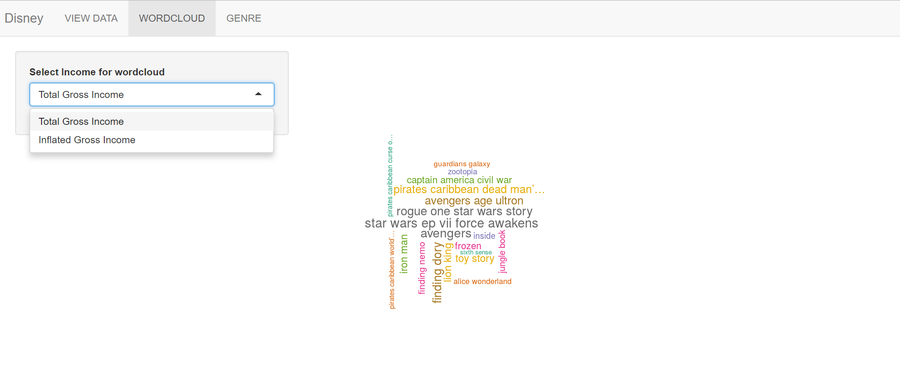
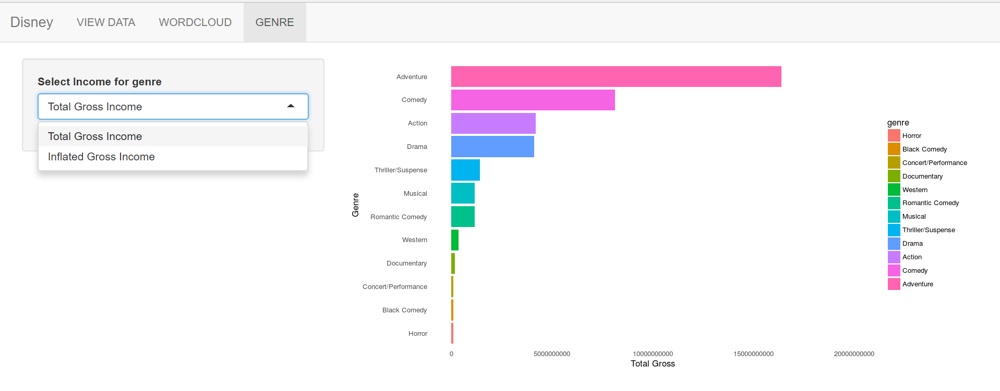

## Introduction :
This presentation is a part of course in coursera Developing Data Products.
The assignment consists of two parts:

1) Create shiny application and deploy it on Rstudio's server. 
The link for the app is : https://tanika.shinyapps.io/disneyShinyapp/

2) Second, you will use Slidify or Rstudio Presenter to prepare a reproducible pitch presentation about your application.

You can find the source code at : https://github.com/Tani1989/Developing-Data-Products

### There are 3 datasets:

1. Gross_Income - information related to gross and inflation adjusted income of the movies.
2. Characters - information related to characters of the movies.
3. Directors -  infromation related to the directors of the movies.

---

## Working of Shiny App:

You can select the Dataset and the title of the movie to view the related data in the tabular form. 

---

## WordCloud 

You can select the income i.e. Total Gross or Inflation Adjusted from the dropdown and view the wordcloud accordingly - the movie with the highest income appears to be the biggest.

---

## Genre

You can select the income i.e. Total Gross or Inflation Adjusted from the dropdown and view the bargraph accordingly.

